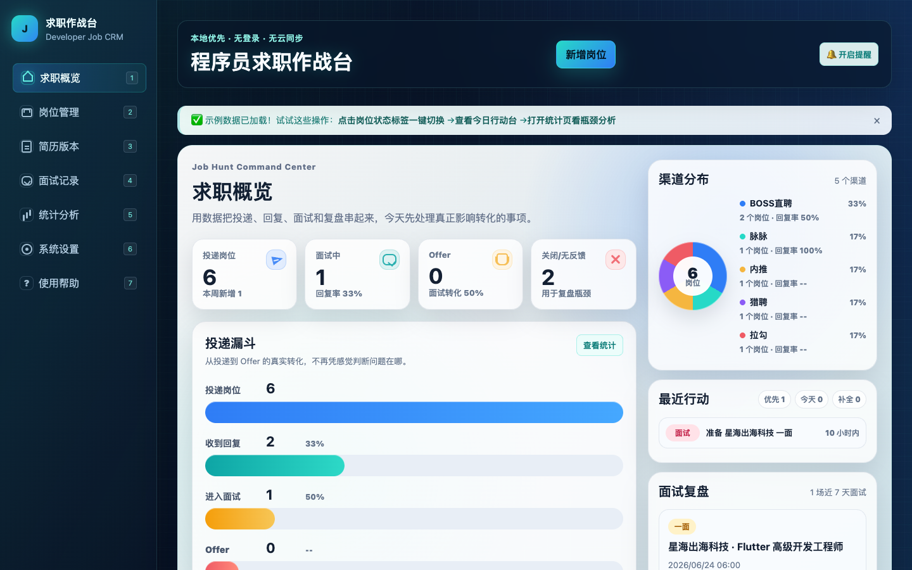
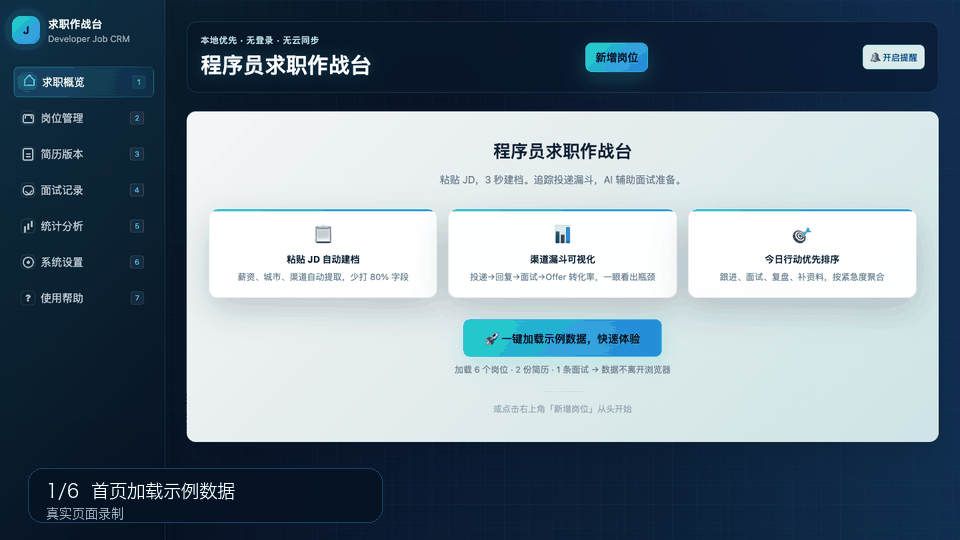

# 我做了一个本地优先的程序员求职 CRM，零后端、零登录、可装桌面

> 粘贴 JD 自动建档，追踪投递漏斗，沉淀面试复盘，用数据看自己到底卡在哪。
> 数据不离开浏览器，AI 是可选的。

## 前言

找工作时，信息常常散落在招聘 App、微信、简历文档和 AI 对话里：

- JD 复制过一次，过几天就找不到
- 投了很多岗位，但很难判断哪个渠道、哪个简历版本更有效
- 面试问了什么，当天还能记得，一周后只剩模糊印象
- AI 能帮忙，但缺少自己的 JD、简历和历史面试上下文

焦虑感上升，数据感很弱。于是我做了 **[程序员求职作战台](https://github.com/brycegao/dev-job-hub)** —— 一个本地优先的求职 CRM，帮开发者把求职信息收束到一个工作台里。



## 它解决什么

核心循环很简单：

```
记录岗位 → 分析 JD → 关联简历 → 跟踪面试 → 复盘数据
```

围绕这个循环，目前覆盖了这些能力：

### 📋 输入减负

- **JD 粘贴自动建档**：粘贴招聘页面文本后，自动提取公司名、岗位、渠道、城市、薪资和工作方式，少打 80% 字段
- **状态一键切换**：在岗位列表点击状态标签即可流转，无需进入编辑表单
- **渠道自动补全**：根据历史岗位渠道提供输入建议
- **面试标签填充**：新建面试时可根据 JD 关键词自动生成问题标签

### 📊 输出复盘

- **投递漏斗可视化**：投递 → 回复 → 面试 → Offer，逐层看转化率，一眼找到瓶颈
- **渠道分布分析**：环形图 + 列表，各渠道回复率和面试率对比
- **今日行动台**：聚合跟进、面试、复盘、超期无反馈和资料补全任务，按紧急度排序
- **智能提醒**：提示停滞岗位、近期面试、历史薄弱点与当前 JD 的重合
- **跨面试薄弱点**：自动统计高频薄弱点，帮你发现反复踩坑的知识方向
- **一键导出 AI 上下文**：所有简历 + JD + 面试复盘 → Markdown，直接粘贴给 ChatGPT / DeepSeek

### ⌨️ 程序员友好的交互

- **键盘快捷键**：`N` 新增岗位、`1-7` 切页面、`?` 帮助、`Esc` 关闭表单
- **PWA 安装到桌面**：点击安装提示，像桌面应用一样使用，离线可用
- **浏览器通知**：面试前自动推送提醒

## Command Center 概览页设计

最近重做了概览页，从传统的卡片列表改为 **Command Center（指挥中心）** 布局：



主区域包含：

- **四色指标卡**：投递岗位（蓝）、面试中（青）、Offer（橙）、关闭/无反馈（红），点击直达统计页
- **投递漏斗**：水平进度条 + 层间转化率，从投递到 Offer 一眼看清卡在哪里
- **今日行动面板**：按优先/今天/补全三档聚合，可筛选

右侧栏包含：

- **渠道分布环形图**：conic-gradient 纯 CSS 实现，零依赖图表库
- **最近行动**：按优先级聚合待办，点击跳转
- **面试复盘卡片**：展示近 7 天最近一场面试信息

整个布局用 CSS Grid 实现响应式，移动端侧栏自动堆叠到下方。

## 技术架构

### 为什么本地优先

求职数据很私密。JD、简历、薪资、面试反馈、失败原因，这些不适合默认上传到服务端。

所以项目从一开始就定下原则：**不登录、不需要后端、不做云同步**。数据保存在浏览器 IndexedDB，AI 是可选的。

技术选型：

| 层 | 方案 |
|---|---|
| 框架 | React 19 + TypeScript strict |
| 构建 | Vite 6 |
| 样式 | 纯 CSS + CSS Custom Properties，无组件库 |
| 数据存储 | 原生 IndexedDB（applications、resumes、interviews 三个 store） |
| PWA | vite-plugin-pwa + Workbox，安装提示 + 离线就绪 |
| 测试 | Vitest + happy-dom，12 个测试文件，127 个用例 |
| AI | 可选 OpenAI-compatible / Ollama Provider，未配置时仍可使用本地规则和 Prompt Pack |

整个项目 **零运行时依赖**（仅 React 和 React DOM），纯 ESM，无 path aliases，所有导入都是相对路径。

### 三层架构

```
src/
  app/                    # UI 层：页面组件、路由、hooks
  features/
    applications/         # 岗位领域模型、仓储和服务
    resumes/              # 简历版本管理
    interviews/           # 面试记录
    jd-analysis/          # JD 关键词规则（47 条纯同步规则）
    resume-match/         # 简历与 JD 匹配建议
    analytics/            # 漏斗指标、瓶颈和薄弱点洞察
    action-plan/          # 今日行动台
    ai-assist/            # Prompt Pack、AI Provider
    data-portability/     # JSON 导入导出
  shared/
    storage/              # IndexedDB 通用封装
    services/             # 浏览器通知等共享服务
    utils/                # 格式化工具
```

关键模式：

- **Repository 模式**：每个领域模块封装自己的 IndexedDB CRUD
- **Service 模式**：业务逻辑（ID 生成、时间戳、数据编排）集中在 services
- **Type-first**：每个模块先定义 `types.ts`，再写仓储和服务
- **纯同步分析**：JD 关键词分析（47 条规则）和简历匹配都是纯函数，无 async

### 视觉设计

样式全部在一个 CSS 文件（3400+ 行），用 CSS Custom Properties 统一主题色：

- 深色侧边栏 `#111827` + 浅色主区域 `#f5f7fb`
- 主色调 teal `#0f766e` / `#14b8a6`
- 导航图标纯 CSS 伪元素绘制（`::before` / `::after`），零 SVG 零字体图标依赖
- 环形图用 `conic-gradient` 实现，零图表库
- 响应式断点 980px，侧边栏自动折叠

## 数据安全

| 数据 | 存储位置 | 是否导出 |
|------|---------|---------|
| 岗位、JD、简历、面试 | 浏览器 IndexedDB | JSON 全量导出 |
| AI Provider 配置 | 浏览器 localStorage | ❌ 不导出（API Key 隔离） |
| AI 上下文 | 按需下载 Markdown | ✅ 不含 API Key |

- 导入 JSON 会替换当前数据，设置页会覆盖前确认
- 使用外部 AI Provider 时，数据直接从浏览器发到对应 API，不经过任何中间服务
- JSON 备份建议每周一次，设置页超过 7 天未导出会自动提醒

## 空状态引导

产品设计的思考：第一次打开工具，用户面对的是空白页面。如何 3 秒内传递价值？

三层递进设计：

1. **首屏 Hero**：三段式布局 —— 标题 + 三个功能亮点卡片 + 一键加载示例数据按钮
2. **引导横幅**：加载示例数据后，顶部出现 8 秒引导横幅，提示核心操作路径
3. **内联提示卡**：各页面空状态显示步骤编号的引导卡片（"第 1 步：新增你的第一个岗位"、"第 2 步：创建简历版本"），串联核心工作流

## 快速开始

```bash
npm install
npm run dev -- --host 127.0.0.1
```

打开 http://127.0.0.1:5173/ ，首页点击「一键加载示例数据」即可体验。

或直接访问在线 Demo：https://brycegao.github.io/dev-job-hub/

支持 PWA 安装 —— 在 Chrome/Edge 地址栏右侧点击安装图标，即可像桌面应用一样使用。

## 项目地址

- **GitHub**：[brycegao/dev-job-hub](https://github.com/brycegao/dev-job-hub)
- **在线 Demo**：[dev-job-hub](https://brycegao.github.io/dev-job-hub/)
- **License**：MIT

如果你正在求职，或者正在帮朋友改简历、复盘面试，欢迎试试看。也欢迎提 issue 和 PR，一起把它打磨成真正适合开发者日常求职的工具。
